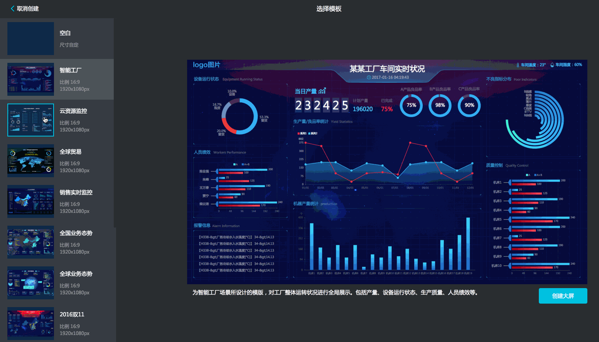
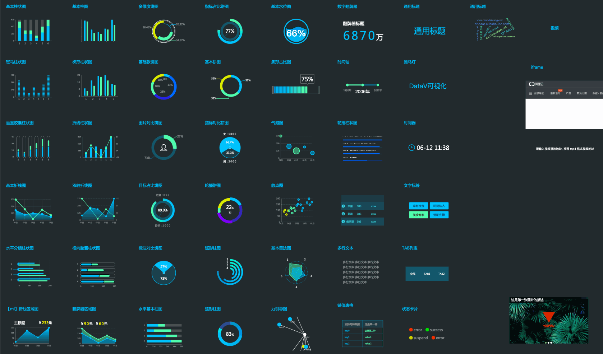
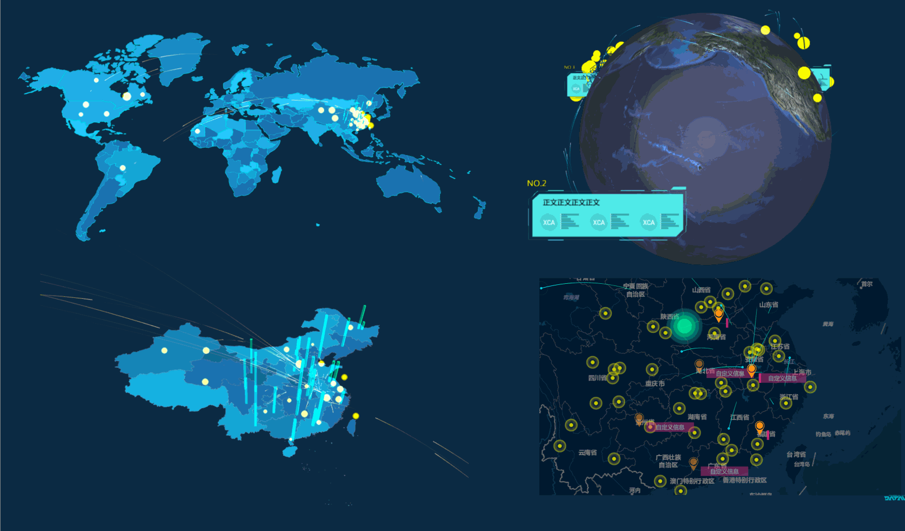
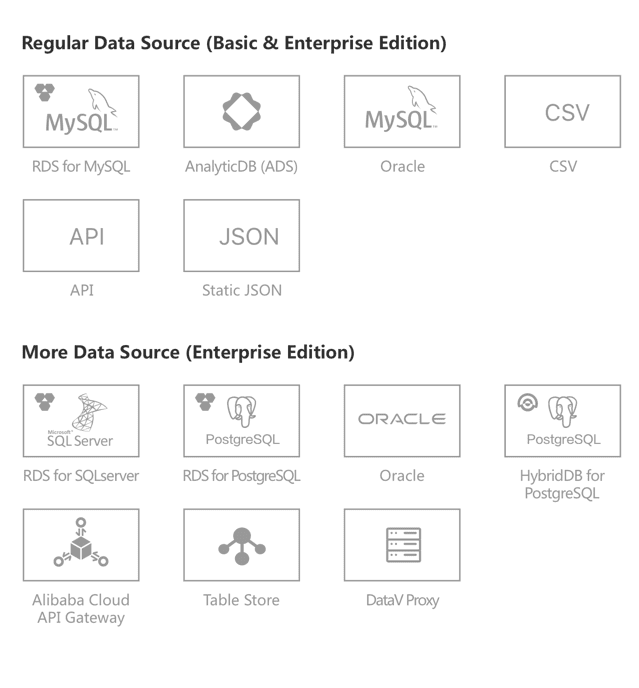
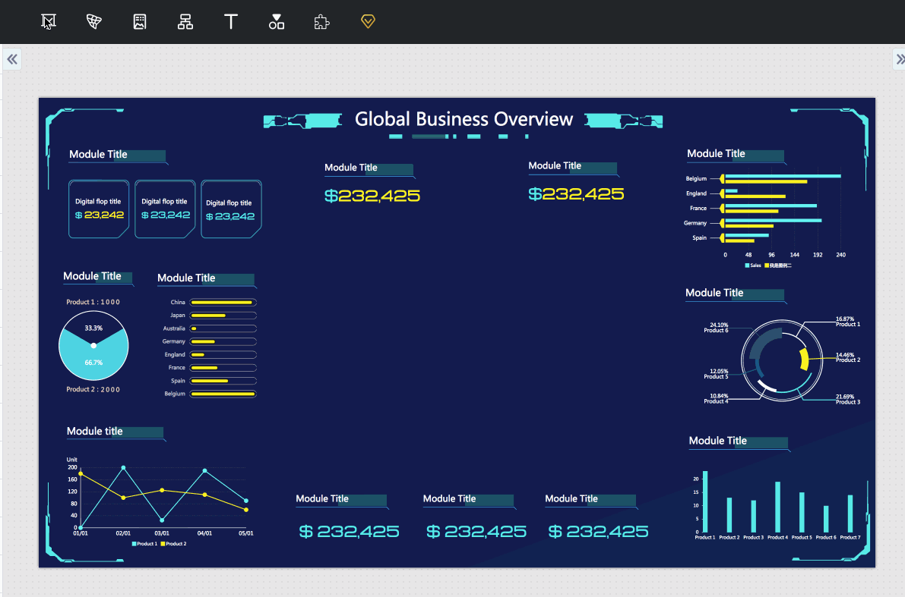
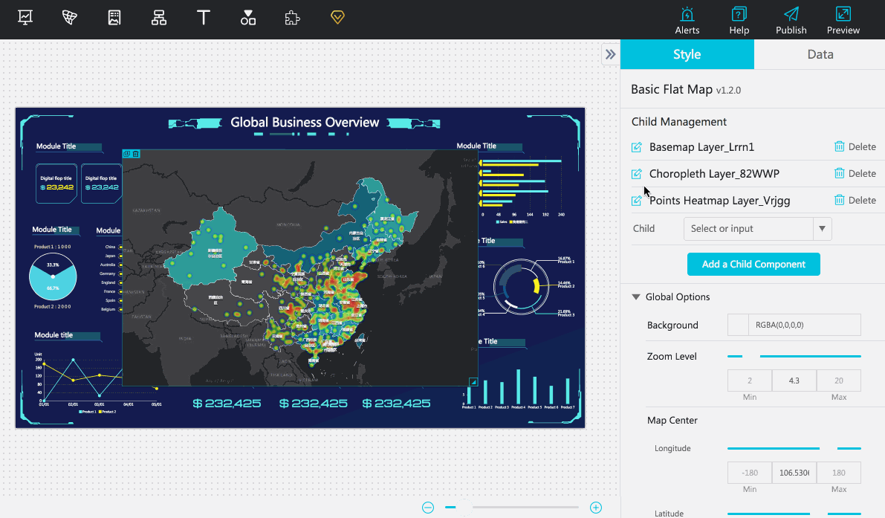
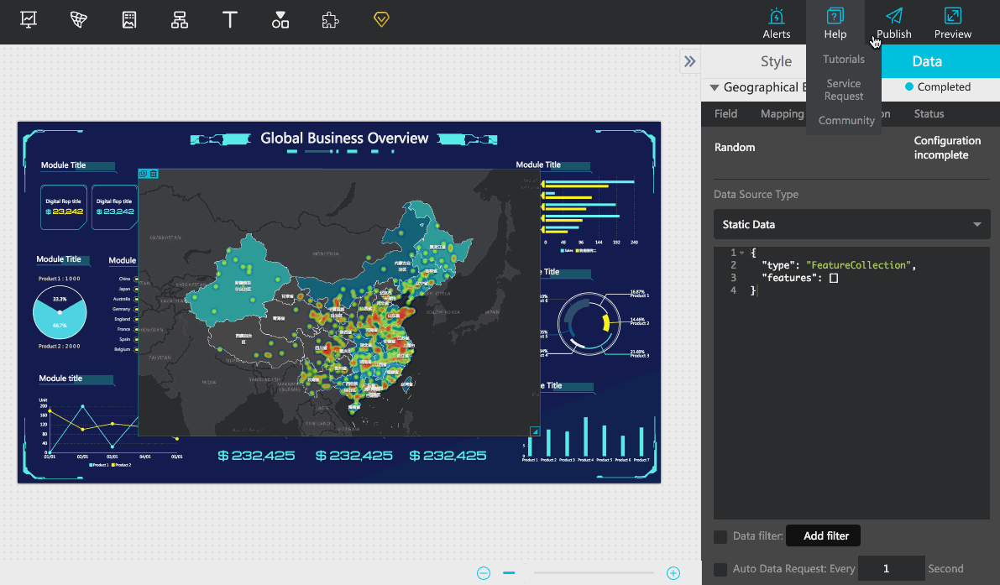

# DataV Visualization

## Summary
0. [Introduction](#introduction)
1. [Features](#features)
2. [Online Experience](#online-experience)
3. [Support](#support)

## Introduction
Data visualization quickly allows you to gain valuable insight into the dynamic and massive data in today’s challenging business environment. Data visualization presents large amounts of data in a more clear and understandable way when compared with traditional charts and data dashboards. It helps you discover and diagnose business problems and opportunities by using interactive video walls.

DataV of Alibaba is a powerful and accessible data visualization tool featuring various visualization templates allowing non-technical personnel to create professional data visualizations through a graphical interface. DataV perfectly satisfies the data presentation demands of exhibitions, business monitoring, risk warning, and geographic information analysis.

## Features

### Various scenario templates

The most difficult part of data visualization design lies in understanding the structural hierarchy and the relationship between various sources of data in only one single article. This involves comprehensive use of colors, layouts, and charts to create a successful visualization. DataV provides multiple templates for scenarios including a control center, geographical analysis, real-time monitoring, reporting, presentation, and many others. Your data visualization presentation can have a high level of design and impact without engaging a professional designer.

### Rich visualization widget libraries

In addition to basic charts, DataV skillfully and effortlessly combines data with geographical information such as air transportation routes, heat maps, and scatter diagrams based on both 2D and 3D maps. Third-party chart libraries such as Echarts and AntV-G2 are also perfectly integrated into DataV.

### Various data sources

DataV supports access to Alibaba Cloud AnalyticDB, Relational Database Service (RDS), local CSV files, online API, and dynamic requests to various data sources. DataV meets your demands related to real-time big data computation and monitoring. DataV makes full use of big data and cloud computing opportunities.

### User-friendly interfaces

With graphic interfaces and configurable widgets, users can create professional visualization projects by using simple drag-and-drop operations. Minimal programming skills are required.

### Multiple scales of resolution and publish methods

DataV projects can be published as webpages or with passwords or access tokens to control access and secure information shown on the dashboard. Optimization improvements have been made to the resolution when splicing screens.

## Online Experience

We have created a static website through OSS. If you want to experience the DataV Demos developed by us, you can visiti the following website address:https://common-source.oss-ap-southeast-1.aliyuncs.com/

## Support

If you need help, please contact [Zouping](zouping.lxp@alibaba-inc.com).